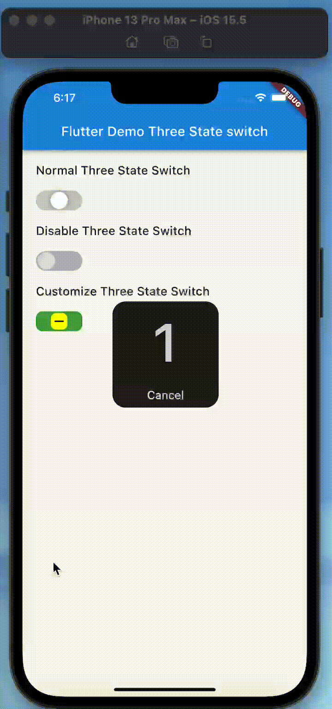

## fl_three_state_switch

<!-- ALL-CONTRIBUTORS-BADGE:START - Do not remove or modify this section -->
[](#contributors-)
<!-- ALL-CONTRIBUTORS-BADGE:END -->

<p align="center">
  
</p>

## Use this package as a library

Add

```yaml
dependencies:
  fl_three_state_switch: ^0.0.1
```
to your pubspec.yaml, and run
```bash
$ flutter pub get
```
in your project's root directory.

Import in your project:
```dart
import 'package:fl_three_state_switch/fl_three_state_switch.dart';
```

## Sample Usage
```dart
class MyHomePage extends StatefulWidget {
  @override
  _MyHomePageState createState() => _MyHomePageState();
}
class _MyHomePageState extends State<MyHomePage> {
  SwitchState _state = SwitchState.start;
  @override
  Widget build(BuildContext context) {
    return Scaffold(
      appBar: AppBar(
        title: Text("Flutter Three State Switch Demo"),
      ),
      body: Center(
        child:FlThreeStateSwtich(
          onChanged: (state) {
            setState(() {
              _state = state;
            });
          },
          state: _state,
        ),
      ),
    );
  }
}
```

### Constructor

| Parameter                 |                       Default                       | Description                                                                                                             |
| :------------------------ | :-------------------------------------------------: | :---------------------------------------------------------------------------------------------------------------------- |
| disable                 |                             false                        |Disable the Switch                                               |
| width                      |                     70.0                                | Width of Switch Container |
| height                       |                   30.0                                  |Height of Switch Container |
| dotVerticalPadding                  |            2                                         |Vertical Padding of Dot                    |
| dotHorizontalPadding                    |         1                                      |    Horizontal Padding of Dot                                                                 |
| borderRadius                     |                  BorderRadius.circular(200) |Border Radius of Switch Container                                                                       |
| startBackgroundColor            |             SwitchColors.backgroundColor //Color(0xFFd1d1d1) |Switch Container Color in start State                                            |
| middleBackgroundColor          |    SwitchColors.backgroundColor //Color(0xFFd1d1d1)    |    Switch Container Color in middle State                                 |
| endBackgroundColor                     |SwitchColors.backgroundColor //Color(0xFFd1d1d1)  |  Switch Container Color in end State                           |
| dotColor         |SwitchColors.dotColor //Color(0xFFFFFFFF)  |Dot Color      |
| disableBackgroundColor|SwitchColors.disableBackgroundColor //Color(0xFFbfbfbf)   |Switch Container Color in disable mode                                        |
| disableDotColor |SwitchColors.disableDotColor //Color(0xFFe3e3e3)            |Dot Color in disable mode                                                                           |
| child |null                 |You can change Dot with any widget you want but be careful you must handle disable mode of your widget by yourself                                                                       |
| state              |SwitchState.start                                    |enum type SwitchState -> SwitchState{start,middle,end}                                                                                      |
| dotShadow       |  [const BoxShadow(color: Colors.black,blurRadius: 10,spreadRadius: -5,)]|Dot shadow                                                            |

